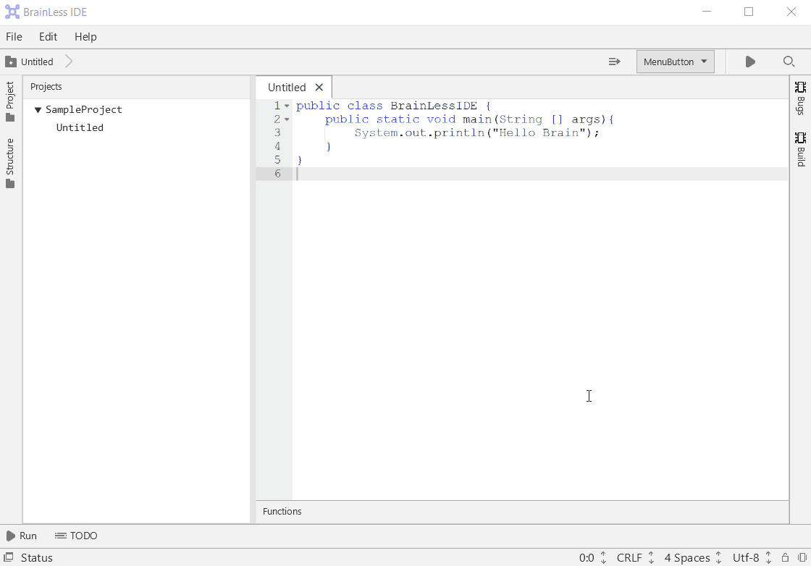

# Brainless-IDE
An attempt to learn IDE(maybe editor if I lose interest) development using JavaFX, Javascript, HTML, CSS and inspired by Intellij GUI.

### Status: Incomplete

# TODO:
1. Add threading
2. Remove fxml view and replace with equivalent java code to dynamically update UI.
3. Ace Editor can be replaced with following 2 libraries. These examples can be included here with least effort, but the codes must be modified heavily to bring expected features and editor UI design.
https://github.com/quickgrid/JavaFx-RichTextFx-RSyntaxTextArea-Example 
4. Splash screen to preload necessary resources.
5. GUIs for each windows such as: preferences, run results, debugging etc.
6. Handle keyboard cut paste.
7. Add support for compiling python, c, c++ etc.
8. Fix file tree to handle new files.
9. Create new tabs on double click or File > Select New.
10. Editor configuration such as text size, font family, language change.

# Features:
Not many features just an attempt to mimick intellij community gui. Most of the GUI objects are created on fxml instead of java class so they need to be changed to add more functionality. This mostly an example starting point for creating a funcitonal program in java.

1. It uses ace editor for for code editing related tasks.
2. JavaFx and Swing with SwingNode for GUI.
3. JavaCompiler to compile code to java class.
4. ProcessBuilder to run the class file and get the output.
5. JavaFx WebView executeScript to communicate from javascript to java.

# Requirement:
1. Openjfx 12+ SDK from, https://gluonhq.com/products/javafx/
2. OpenJDK 12+
3. Intellij with following VM options for each file(to be safe from errors),

`  --module-path C:\Users\computer\Downloads\openjfx-12.0.1_windows-x64_bin-sdk\javafx-sdk-12.0.1\lib --add-modules javafx.controls,javafx.web,javafx.fxml,javafx.swing`

4. In Intellij project settings import library lib folder of downloaded openjfx sdk(extract the zip file to a folder first).
6. JavaFx Scene Builder.
5. Since JavaFx is separate from JDK it may give some error with module which can be solved at step 3. If it still gives error go to openjfx lib folder note all the modules with javafx.* name and add them to existing ones at step 3.
7. Correct path in code for image files in some examples.

# Setup Information
https://openjfx.io/openjfx-docs/

Coming soon.... Mostly GUI Now.

### Update 22-7-2019

### Update 14-7-2019

# Render Problem
Can reduce the impact by setting white background still rendering is slow.

